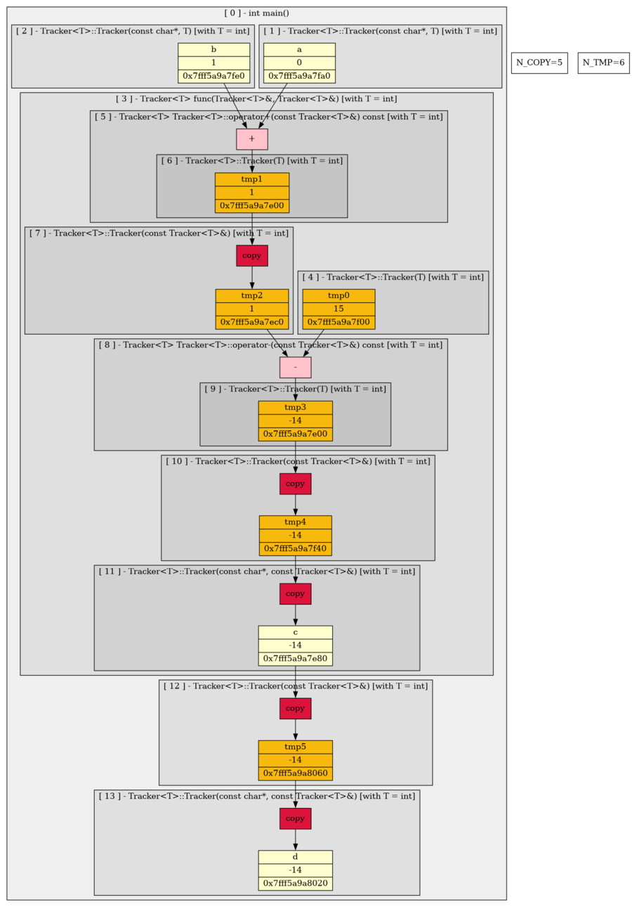
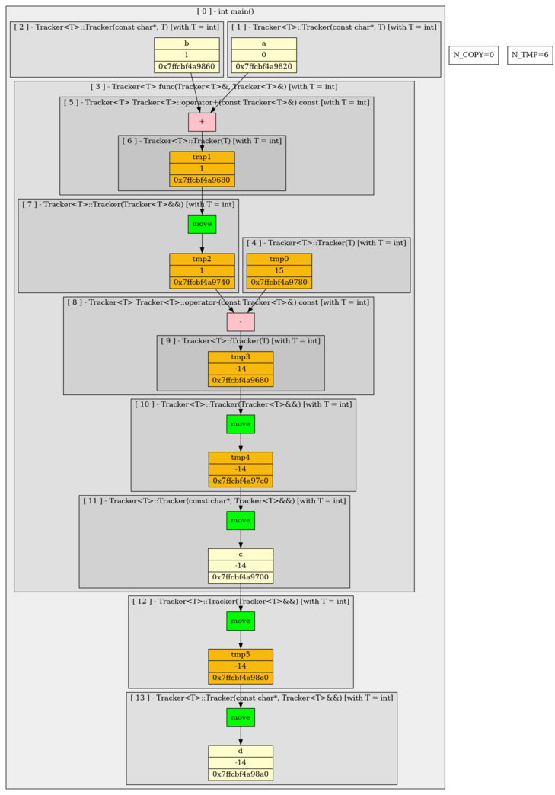

# cpp_class_tracker

## Постановка проблемы
Рассмотрим простой алгоритм, состоящий всего из некоторой арифметической операции над двумя переменными(классами) типа T, результат вычисления которой сохраняется в 3-ю переменную.
```cpp
...

int main(){
  T a = ...
  T b = ...
  
  T c = a + b + T_DEF; // T_DEF - некоторое константое значение типа T
  
  return 0;
}
```
При вычислении значения переменной 'c' необходимо использовать временные переменные, где будут сохраняться определенные промежуточные вычисления.

Например
```
tmp1 = a + b
tmp2 = tmp1  + T_DEF
```

Следовательно во время выполнения операции происходит вызов некоторого количества конструкторов копирования для инциализации временных обьектов и сохранения промежуточных результатов. Если T=int, то боятся нечего, данные копируются за O(1), но если T=std::vector<int> или что еще похуже, в какой-то момент разработчик начнет задаваться вопросом, почему его ассимптотика выполнения его кода с теоритеческой O(1) выдаёт практическую O(n).

## C++ 98/03
Рассмотрим наш пример при T=int, посмотрим где вызываются конструкторы копирования и посчитаем их количество. Учтем, что стандарт c++ 14 года позволяет не создавать временный объект, который используется только для инициализации другого объекта того же типа, экономя copy-вызовы и поставим флаг -fno-elide-constructors, благодаря которому copy-вызовы будут осуществляться везде где только можно.


Имеем 5 конструкторов копирования и 4 временных объектов

Стандарт также позволяет реализовывать конструктор копирования через nonconst lvalue ссылки, что является довольно небезопасным способом для большинства случаев(очевидно почему). Адекватные примеры мне неизвестны, буду рад, если кто-то поделится.

## C++ 11/14
Стандарт с++ 11 года позволил разрешать проблемы подобного рода через move-семантику, конструкцию, позволяющую распознавать временные обьекты(rvalue ссылки??) и выполнять для них поверхностное копирование, вместо глубокого. Это позволяет не тратить ресурсы машины на копирование данных умирающего обьекта(например tmp1 из примера выше), а просто отдать эти ресурсы новому обьекту, который будет жить дальше. 

Имплементируем в наш код move-конструкторы и посмотрим, как много конструкторов копирования изменилось на конструкторы пермещения.


Получаем 3 конструктора копирования и 4 временных обьекта

Что будет если мы реализуем конструктор перемещения через const rvalue ссылки? Обьект будет позиционировать себя как временный, но конструктор к несчастью(или к радости?) данные "украсть" не сможет.
